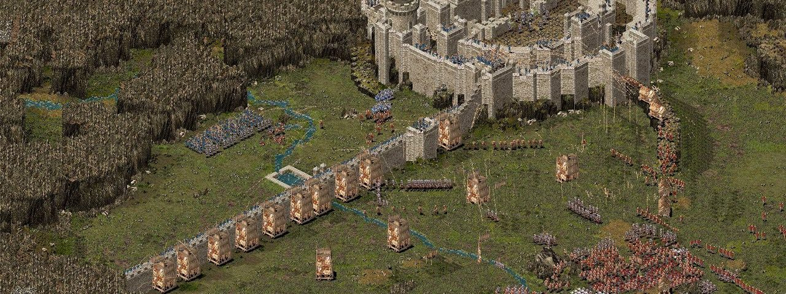

# Zadanie domowe - piąty wykład

Mongołowie zaatakowali Chiny. Wygrali, teraz ich wzrok skierowany jest ku Japonii. Szogun wyczuwając
zagrożenie zaczyna przygotowania do wojny. Buduje liczne twierdze na wybrzeżach, wysyła do nich wojska, a w spichlerzach gromadzi jedzenie na wypadek oblężeń.

Poprosił Cię o przygotowanie funkcjonalności obliczającej maksymalną ilość dni oblężenia dla swoich twierdzy.

Założenia:
- każdy budynek ma spichlerz (`buildings.granary`)
- piechota zużywa 1 porcję jedzenia dziennie
- jednostki konne zużywają 2 porcje jedzenia dziennie
- twierdza potrzebuje też ludzi, którzy nie są wojownikami.
  Startowe dzienne zapotrzebowanie jedzeniowe twierdzy wynosi 10 porcji jedzenia.
- twierdza bez stacjonującego wojska nie wytrzyma nawet jednego dnia oblężenia

Zadanie:
- endpointy `/buildings` i `/buildings/:id` powinny zwracać atrybuty budynków w formacie JSON::API
- jednym z atrybutów budynku jest `siege_ability` - oznacza ilość dni oblężenia jaką może wytrzymać dana budowla
- logikę nowej funkcjonalności umieść w klasie `Reports::SiegeReport`
- napisz test sprawdzający statusy HTTP (`200` i `404`) nowych endpointów
- napisz test klasy `Reports::SiegeReport`. Pamiętaj o tzn. edge case'ach
